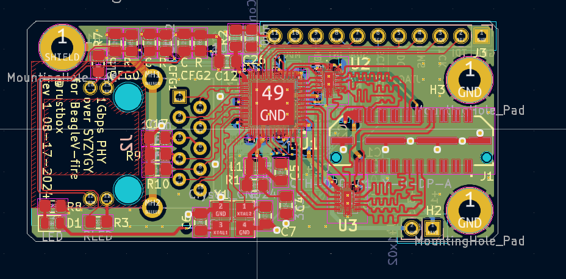
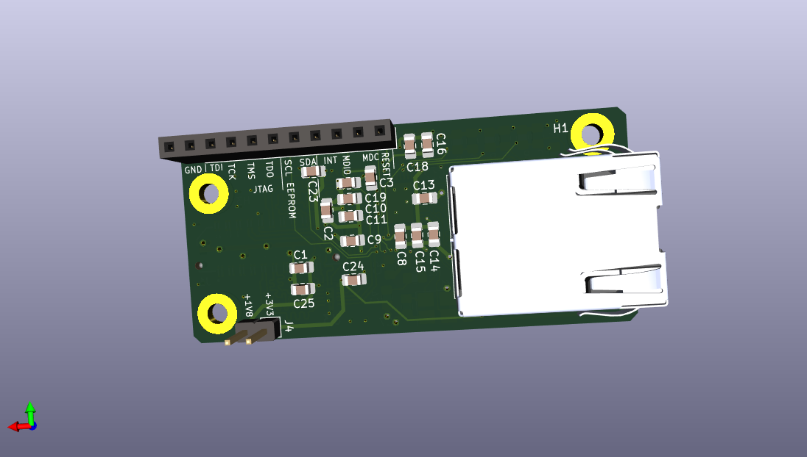
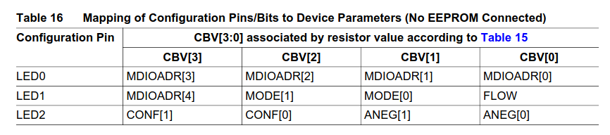

# SYZYGY-PHY

This is an ethernet PHY board. This takes RGMII from the PHY and places it over the SYZYGY connector, intended to plug into the BeagleV-fire board.

## PCB

## Strapping Pins

The GPY111 allows different combinations of a 100 nF and various resistor values to produce different 4 bit values in the pin strapping configurations.

There are three strapping pin inputs, LED0, LED1, and LED2 giving 12 bits in total configuration information.

The below **Table 15** (page 42) shows how each Capacitor/Resistor combination forms to produce a 4 bit value

**Table 16** (page 42) and Table 17 (page 43, not shown here) shows the meaning of each bit

For our implementation:

`MDIO[4:0] = 0bABCDE` where `MDIO` is the address to use to talk to the PHY using the MDIO interface. Each of A, B, C, D, and E are bit variables, can be freely chosen to be 0 or 1, forming the "address".
    
`FLOW = 0` where `FLOW` means we're connecting to 1000BASE-T

`MODE[1:0] = 0b00` where `MODE` means we're talking RGMII to the MAC

`CONF[1:0] = 0b11` where `CONF` means 0 ns skew between Clock and Data for both Rx and Tx

`ANEG[1:0] = 0b00` where `ANEG` concerns auto negotiation of speeds. `0b00` means that the GPY111 will automatically go between 10/100/1000 Mbps.

So this means:

    LED0 = 0bBCDE
    LED1 = 0bA000
    LED2 = 0b1100

Therefore:
* LED0: resistor and capacitor should be chosen based on the pattern of `0bBCDE`
* LED1: resistor value should be 11.0 kOhm, with no capacitor
* LED2: resistor value should be 3.92 kOhm, with a 100 nF capacitor
