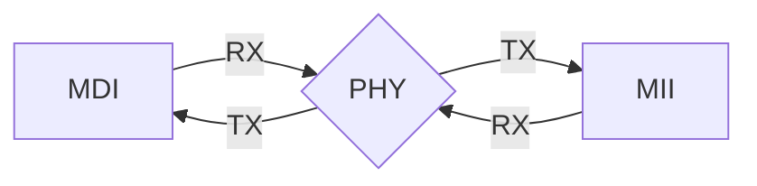
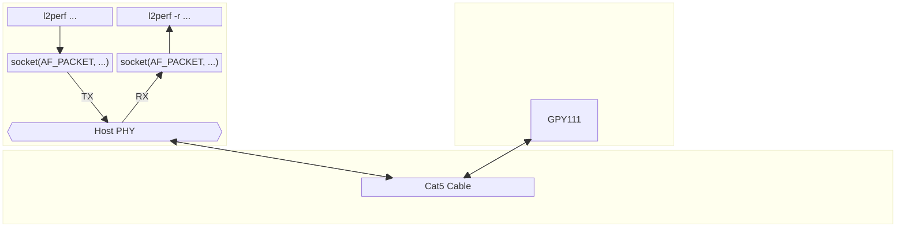

# SYZYGY-PHY test plan

Some notes on the test plan for this board after assembly.

## Equipment

- Digilent Digital Discovery
    - Logic Analyzer
        - 800 MS/s sample rate
        - 100 MHz bandwidth
    - Pattern Generator/Digital I/O
        - 100 MS/s sample rate
        - 50 MHz max output frequency
    - Power Supply
        - 2x 1.2V to 3.3V outputs
        - 100mA limit (each)
- esp32c3 (DevKitM-1)
    - Includes an CP2102N USB-UART bridge + micro-USB port
    - Operates at 160MHz
- Test host (computer)
    - running Linux
    - With available Ethernet port (AKA "NIC", though [that term is too imprecise for our purposes](https://networkengineering.stackexchange.com/a/77767)) 

And standard USB cables to plug the first two in to the host.

Also, maybe?

- USB breakout cable for talking to the secondary interface on the 'c3?
- A "medium-end loop" RJ-45 ethernet cable with the far end cross-wired?
- an ethernet cable and a second SYZYGY-PHY?
- An ethernet device on the host side that we can `AF_PACKET` write raw frame out of?

## Loops to Test

There's two main functional areas we'd like to test:

1. MDI (i.e. "Ethernet")
2. MII (i.e. "RGMII")

Ideally, we'd like to validate the performance of the PCB at full gigabit speeds, which for both would be 125MHz sending a bit on both rising and falling edges of the clock (DDR), or 250MHz SDR.

The PHY splits these into two separate `RX<->TX` "loops" that can be tested independently:



Including the `MDI -> MII -> MDI` end to end loop ("MAC loop") we find these observable "walks":

1. MDI (RX) -> PHY -> MII (TX)
2. MII (RX) -> PHY -> MDI (TX)
3. MII (RX) -> PHY -> MII (TX)
4. MDI (RX) -> PHY -> MDI (TX)

(Note the directions are from the perspective of the PHY itself; so MDI (RX) means we received a signal over the Cat5 cable, and MII (TX) means the PHY sent that signal outbound on the MII channel).

The PHY itself can also act as a packet source if side-loaded via the MDIO channel, and can track error counters for received malformed packets, adding two potential extra edges to test:

1. PHY -> MDI (TX)
1. MDI (RX) -> PHY

## Signals

Listing some properties of both the functional and non-functional signals in the design.

### MDI

Something something autonegotiation?

10BASE-T(X?)?

100BASE-T(X?)?

1000BASE-T

    f: 125 MHz (DDR, implicit clock)
    5v range (-2.5v to 2.5v) with 5 levels
    8b/10b encoding

### MII

RGMII

An independent set of wires makes up each direction that are asynchronous relative to each other.

    f: 125 MHz (DDR, explicit clock each direction)


### JTAG

it's a clocked synchronous protocol that has some provision for chaining?


### MDIO

Looks like a synchronous protocol; over some number of other wires?

## Test Cases (planned)

### JTAG test

"Simply" reading back the GPY111's IDCODE and checking that it matches the value listed in the datasheet (see below) will validate:

1. Our JTAG "loop" (NB: we haven't "chained" any of the JTAG interfaces)
2. Power & startup & the GPY and a bunch of other stuff?

#### Far-End Loop

At a high level, the idea is to turn the PHY into a layer 2 reflector so we can send a packet out a peer interface and receive the same packet through the same interface. The far-end test loop fits this bill, and as a bonus doesn't depend on the xMII interface:

> The PCS far-end test loop allows for the receive data at the output of the receive PCS to be fed back into the
transmit path, that is, the input of the transmit PCS. The received data is also available at the xMII interface output,
however all xMII transmit data is ignored in this test mode. [...] This test loop is activated by setting the bit
MDIO.PHY.PHYCTL1.TLOOP = FETL. Note that the test-loop is only operable when the link is operational. **It is
activated at the next link-up.**
—GPY111 Datasheet §3.6.3.2

To play the role of the peer, we'll want a program that sidesteps IP (the Internet Protocol): an [AF_PACKET socket](https://www.man7.org/linux/man-pages/man7/packet.7.html) fits the bill. Happily, there's already a Rust library, [`libpnet`](https://github.com/libpnet/libpnet) that [exposes AF_PACKET sockets](https://github.com/libpnet/libpnet/blob/a01aa493e2ecead4c45e7322b6c5f7ab29e8a985/pnet_datalink/src/linux.rs#L9). Even better, there already exists a `l2perf` tool that round-trips packets at a measured throughput, and implements a simple counter-based protocol for quantifying packet loss. We have a [fork of `l2perf`](https://github.com/rustbox/l2perf) that we can adapt to our needs.

So with the cast of players thus identified, we have this picture:



(sorry for the weird diagram, I did my best with mermaid's tools)

So the plan to test this journey is to:

0. Clone the `l2perf` repo on the host machine
1. Poke the value `0b010_0_0000_0000_0001` into the `PHY_PHYCTL1` MDIO register (addr = 0x13) to turn on far-end test mode.
2. Start the `l2perf` receiever:
    ```
    cargo build --release && sudo setcap 'cap_net_raw=ep' target/release/l2perf && ./target/release/l2perf -i INTERFACE -r
    ```
    where INTERFACE corresponds to the test host's port connected to the GPY111
3. Start the `l2perf` transmitter:
    ```
   cargo build --release && sudo setcap 'cap_net_raw=ep' target/release/l2perf && ./target/release/l2perf -i INTERFACE 00:00:00:00:00:00 -b 1000
    ```
     (again, replacing INTERFACE as appropriate)

## Test Cases (experimental results)

### JTAG test

We experimented with communicating over JTAG in [jtag.rs](../jtag/jtag.rs); results were somewhat inconclusive, getting back mostly inconsistent or non-existent answers. Something something AC characteristics, JTAG TAP state machine mismatch yadda yadda?

### PHY tests

We experimented with communicating via MDIO in [mdio.rs](../jtag/mdio.rs); we observed a few mismatches with our expectations, including:

* Apparently the PHY's MDIO address was strapped to 3 (0b00011) instead of the 1 we expected.
* We got somewhat strange/inconsistent results with communications: sometimes it seemed as though we were playing tug-of-war with the line state maybe?

We also didn't find a way to make use of either near-end test loop, since our board rev 0 didn't have a functional xMII interface.

#### Far-End Loop

Testing with a veth pair and a trivial loop-back program running on the far end to emulate the GPY111's expected behavior did produce a positive result. However, running the test plan did not. We observed:

* The transmitter reported normal output of ~800k 1500-byte packets over 10 seconds (an average rate just under 1 Gbps)
* One of the GPY-driven LEDs flashed during the duration of the test
* No packets were received by the receiver (100% packet loss)

There are a few places our signal might be getting munged:

- The GPY111 might not be operating in the test mode
    - Our confidence in the MDIO communication code is low, as is our confidence that our config is complete.
    - Is there a mechanism to read what the GPY111 thinks is its current state?
    - We believe we can check this by looking at the counters; specifically, the PHY_ERRCNT register (nonstandard), see below.
- The circuit itself; if the blinking LED means we successfully received a signal, this would be somewhat strange, since at a link speed of 1000 Mbps there's no distinction between the tx and rx paths. Instead, all four pairs are used for both simultaneously (the transmitters simply "subtract out" their own signal to recover what the other side was saying).
- The host kernel

##### Reading the PHY_ERRCNT register

The general idea is to "select an [error] event" by writing to the top half of the register, and then reading from the bottom half. The counter is self-resetting on read, so the rough procedure is:

1. Write 0b0000_ESEL_00000000 to PHY_ERRCNT at offset 0x15 where ESEL is one of:
    - 0b0001 for received frames
    - 0b0101 for transmitted frames
    - (see datasheet for others)
2. Start the test
3. Either periodically, or on demand, read the register at offset 0x15 (which will consume the value)

We'd like both counters to line up with the status from `l2perf`. If we see:

- 0 rx, 0 tx -> our circuit is bad; and it's so bad, apparently, that it makes the LEDs wobble?
- 0 rx, nonzero tx -> the GPY is pulling things out of the ether, we're _very_ confused
- nonzero rx, 0 tx -> the GPY is not actually in test mode
    - try togglng the link ("activated at the next link-up")?
- nonzero rx, nonzero tx -> the GPY is probably functioning as we expect, but the return packets are getting eaten by either the host-side PHY or the linux kernel
    - try setting the destination MAC to something not-zero (`00:...:00`); maybe a broadcast address? the address of the interface itself (conveniently available at `/sys/class/net/INTERFACE/address`)?
    - try enabling "promiscuous mode" by way of: `sudo ip link set INTERFACE promisc on`, and/or using a tool like wireshark to observe the packets?
    - (note: if either of the above work, then it's a bug in `l2perf` that it's not setting the right flags on its socket; if neither of the above work, then we're gonna have a hard time getting confidence out of the "test packet generator" because the scope of packets it can generate is pretty limited, and it's probably something weird to learn about linux networking config gunk)

Other interesting stats available via MDIO:

- STD_GSTAT (offset 0x0a, standard) reports, among others:
  - LRXSTAT bit for the local receiver status
  - RRXSTAT bit for the remote receiver status
- PHY_PHYPERF (offset 0x10, nonstandard) reports
  - Frequency offset of link partner (in PPM, signed)
  - Signal-to-Noise ratio (in dB, unsigned?)
  - Estimated loop length (in multiples of 10m, unsigned)
 
Also, we could consider: 

- `ethtool -S INTERFACE` would also tell us how many tx_packets and rx_packets have gone through the host side to some level of fidelity
- https://github.com/wkz/mdio-tools , which might let us poke the host-side PHY directly for _its_ config & status registers (maybe it's got a toggle for "let unrecognized traffic through"?


