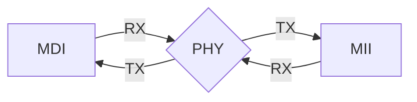

# SYZYGY-PHY test plan

Some notes on the test plan for this board after assembly.

## Equipment

- Digilent Digital Discovery
    - Logic Analyzer
        - 800 MS/s sample rate
        - 100 MHz bandwidth
    - Pattern Generator/Digital I/O
        - 100 MS/s sample rate
        - 50 MHz max output frequency
    - Power Supply
        - 2x 1.2V to 3.3V outputs
        - 100mA limit (each)
- esp32c3 (DevKitM-1)
    - Includes an CP2102N USB-UART bridge + micro-USB port
    - Operates at 160MHz
- Test host (computer)

And standard USB cables to plug the first two in to the host.

Also, maybe?

- USB breakout cable for talking to the secondary interface on the 'c3?
- A "medium-end loop" RJ-45 ethernet cable with the far end cross-wired?
- an ethernet cable and a second SYZYGY-PHY?
- An ethernet device on the host side that we can `AF_PACKET` write raw frame out of?

## Loops to Test

There's two main functional areas we'd like to test:

1. MDI (i.e. "Ethernet")
2. MII (i.e. "RGMII")

Ideally, we'd like to validate the performance of the PCB at full gigabit speeds, which for both would be 125MHz sending a bit on both rising and falling edges of the clock (DDR), or 250MHz SDR.

The PHY splits these into two separate `RX<->TX` "loops" that can be tested independently:

Including the `MDI -> MII -> MDI` end to end loop ("MAC loop") we find these observable "walks":

1. MDI (RX) -> PHY -> MII (TX)
2. MII (RX) -> PHY -> MDI (TX)
3. MII (RX) -> PHY -> MII (TX)
4. MDI (RX) -> PHY -> MDI (TX)

(Note the directions are from the perspective of the PHY itself; so MDI (RX) means we received a signal over the Cat5 cable, and MII (TX) means the PHY sent that signal outbound on the MII channel).

The PHY itself can also act as a packet source if side-loaded via the MDIO channel, and can track error counters for received malformed packets, adding two potential extra edges to test:

1. PHY -> MDI (TX)
1. MDI (RX) -> PHY

## Signals

Listing some properties of both the functional and non-functional signals in the design.

### MDI

Something something autonegotiation?

10BASE-T(X?)?

100BASE-T(X?)?

1000BASE-T

    f: 125 MHz (DDR, implicit clock)
    5v range (-2.5v to 2.5v) with 5 levels
    8b/10b encoding

### MII

RGMII

An independent set of wires makes up each direction that are asynchronous relative to each other.

    f: 125 MHz (DDR, explicit clock each direction)

### JTAG

it's a clocked synchronous protocol that has some provision for chaining?

### MDIO

Looks like a synchronous protocol; over some number of other wires?

## Test Cases (planned)

### JTAG test

"Simply" reading back the GPY111's IDCODE and checking that it matches the value listed in the datasheet (see below) will validate:

1. Our JTAG "loop" (NB: we haven't "chained" any of the JTAG interfaces)
2. Power & startup & the GPY and a bunch of other stuff?
